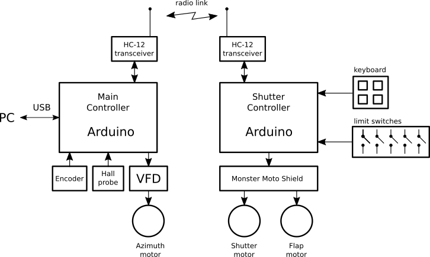
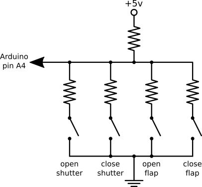

ArduinoDomeController
=====================

An astronomical observatory dome controller based on two Arduino boards.

 * The main controller (DomeController)
 * The shutter controller (DomeShutter)

 

Main controller
---------------

The main controller is connected to a PC by a USB cable. It uses the MaxDome II serial
protocol for compatibility with existing software.

Azimuth angle is read by an optical encoder connected to a rubber wheel that
rotates with the dome. A hall probe is used to detect the "home" mark, wich
serves as an absolute reference for azimuth angle.

The azimuth motor is a three-phase driven by a variable frequency drive. Three
Arduino pins control the VFD through NPN transistors:

 * Move motor clockwise
 * Move motor counterclockwise
 * Jog (slow motion)
 
For more details, read the definitions in [DomeController.ino](DomeController/DomeController.ino).

Shutter controller
------------------

The shutter controller is mounted in the rotating dome and it is powered by
a 12v lead-acid battery. The battery can be charged with

 * a solar panel (the solution I am using).
 * a trickle charger connected to the battery with two brushes when the dome is
   in the home position.

The shutter controller communicates with the main board by means of a serial
radio link created with HC-12 modules.

 

Shutter and flap DC motors are controlled by a Monster Moto Shield.

Five limit switches are used. Pin numbers are defined in [DomeShutter.ino](DomeController/DomeShutter.ino).

 * Shutter closed
 * Shutter fully open
 * Flap closed
 * Flap fully open
 * Flap and shutter mechanical interference

The 4-button keyboard in the shutter controller is read using only one analog pin.

 

For more details, read the definitions in [DomeShutter.ino](DomeController/DomeShutter.ino).
